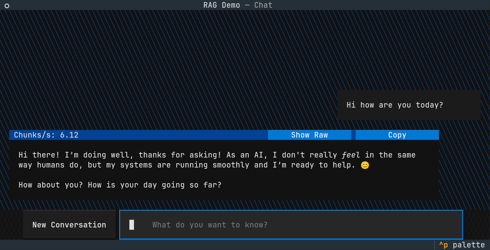

# RAG-demo

Chat with (a small portion of) Wikipedia

⚠️ RAG functionality is still under development. ⚠️



## Requirements

 1. The [uv](https://docs.astral.sh/uv/) Python package manager
    - Installing and updating `uv` is easy by following [the docs](https://docs.astral.sh/uv/getting-started/installation/).
    - As of 2026-01-25, I'm developing using `uv` version 0.9.26, and using the new experimental `--pytorch-backend` option.
 2. A terminal emulator or web browser
    - Any common web browser will work.
    - Some terminal emulators will work better than others.
      See [Notes on terminal emulators](#notes-on-terminal-emulators) below.

### Notes on terminal emulators

Certain terminal emulators will not work with some features of this program.
In particular, on macOS consider using [iTerm2](https://iterm2.com/) instead of the default Terminal.app ([explanation](https://textual.textualize.io/FAQ/#why-doesnt-textual-look-good-on-macos)).
On Linux you might want to try [kitty](https://sw.kovidgoyal.net/kitty/), [wezterm](https://wezterm.org/), [alacritty](https://alacritty.org/), or [ghostty](https://ghostty.org/), instead of the terminal that came with your desktop environment ([reason](https://darren.codes/posts/textual-copy-paste/)).
Windows Terminal should be fine as far as I know.

## Optional stuff that could make your experience better

 1. [Hugging Face login](https://huggingface.co/docs/huggingface_hub/quick-start#login)
 2. API key for your favorite LLM provider (support coming soon)
 3. Ollama installed on your system if you have a GPU
 4. Run RAG-demo on a more capable (bigger GPU) machine over SSH if you can. It is a terminal app after all.

## Run the latest version

Run in a terminal:
```bash
uvx --no-cache --torch-backend=auto --from=jehoctor-rag-demo@latest chat
```

Or run in a web browser:
```bash
uvx --no-cache --torch-backend=auto --from=jehoctor-rag-demo@latest textual serve chat
```

## Run from the repository

First, clone this repository. Then, run one of the options below.

Run in a terminal:
```bash
uv run chat
```

Or run in a web browser:
```bash
uv run textual serve chat
```

## CUDA acceleration via Llama.cpp

If you have an NVIDIA GPU with CUDA and build tools installed, you might be able to get CUDA acceleration without installing Ollama.

```bash
CMAKE_ARGS="-DGGML_CUDA=on" uv run chat
```

## Metal acceleration via Llama.cpp (on Apple Silicon)

On an Apple Silicon machine, make sure `uv` runs an ARM interpreter as this should cause it to install Llama.cpp with Metal support.

## Ollama on Linux

Remember that you have to keep Ollama up-to-date manually on Linux.
A recent version of Ollama (v0.11.10 or later) is required to run the [embedding model we use](https://ollama.com/library/embeddinggemma).
See this FAQ: https://docs.ollama.com/faq#how-can-i-upgrade-ollama.

## Project feature roadmap

- ❌ RAG functionality
- ❌ torch inference via the Langchain local Hugging Face inference integration
- ❌ uv automatic torch backend selection (see [the docs](https://docs.astral.sh/uv/guides/integration/pytorch/#automatic-backend-selection))
- ❌ OpenAI integration
- ❌ Anthropic integration
